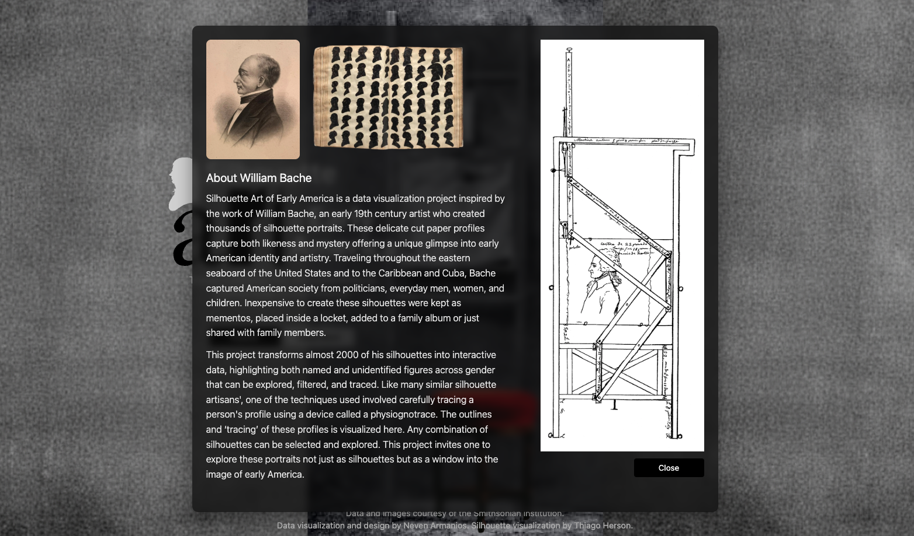
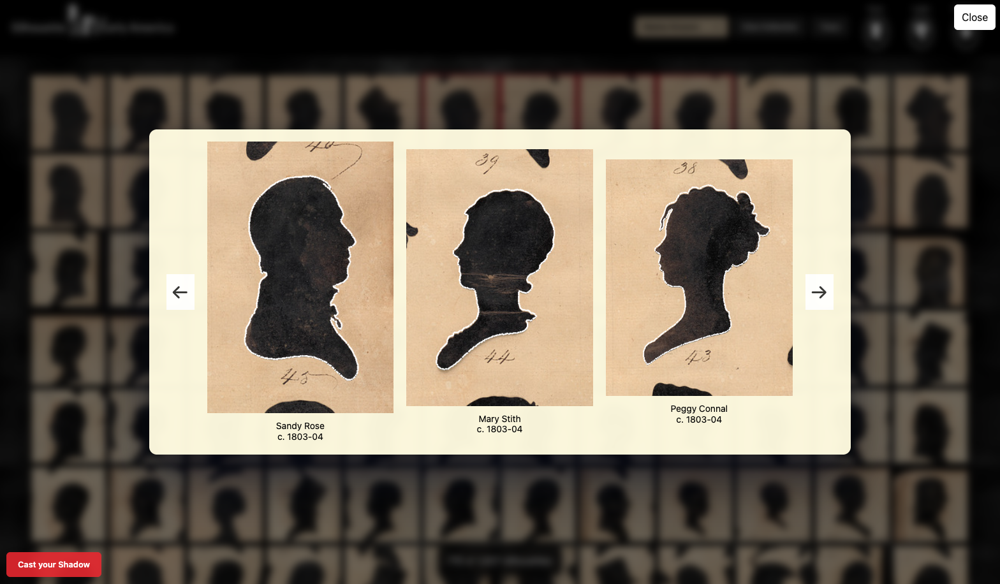
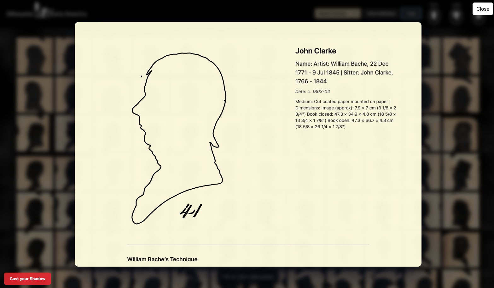
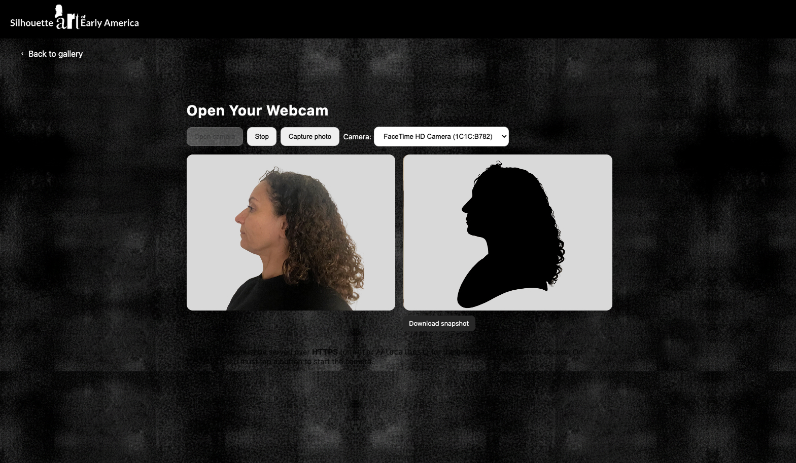
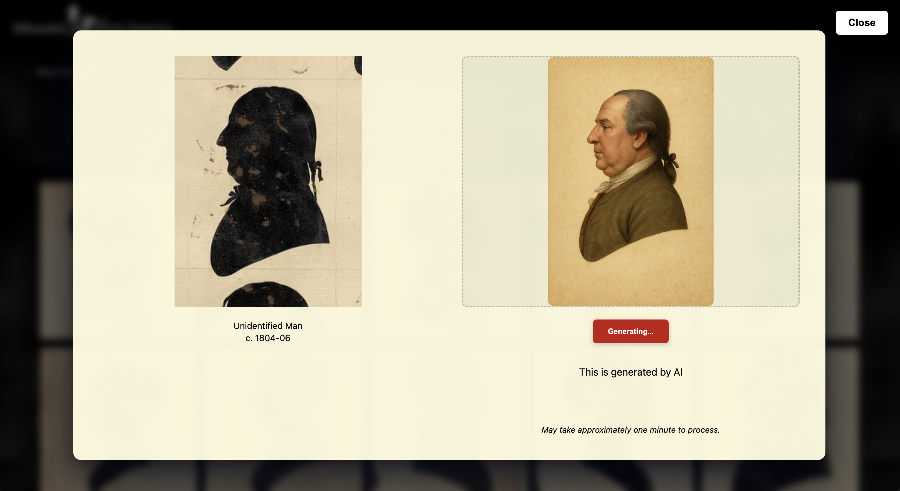

## Silhouette Art of Early America

### Traced in Shadow: The Silhouette Sitters & Diverse Faces of Early America

https://narmanios.github.io/SilhouetteArt/index.html

'Silhouette Art of Early America' is a data visualization inspired by the work of William Bache. It explores over 1800 of his silhouettes. Inexpensive to create his sitters could keep them as mementos, share with family or place them inside a locket. The sitters include unidentified as well as named men, women and children. Like many similar silhouette artisans', one of the techniques involved carefully tracing a person's profile using a device called a physiognotrace. The outlines and ‘tracing’ of these profiles is visualized in this project. Any combination of silhouettes can be selected and explored.

---

### Thanks & credits

This digital project is inspired by work supported through the Getty Foundation’s Paper
Project initiative. It draws upon materials from the Smithsonian Institution’s Open Access collections, including the digitized ledger book of silhouette artist William Bache (ca.1803–1812) and his silhouette album held by the National Portrait Gallery. The Bache album of portraits of early nineteenth century sitters was fully digitized thanks to Getty support and the National Portrait Gallery’s ongoing conservation and research efforts.

#### Bache Album information

https://npg.si.edu/bache

#### Dataset

In addition, this project utilises the Smithsonian Revolutionary Era Collections dataset, a curated subset of the Smithsonian’s Open Access corpus created by the Revolution Crossroads initiative. The dataset brings together 12,667 records and nearly 3,941 linked images of objects dating from 1770–1810, drawn from four Smithsonian museums: the National Museum of American History, the National Postal Museum, the Smithsonian American Art Museum, and the National Portrait Gallery.

https://huggingface.co/RevolutionCrossroads

#### Neven Armanios, Data Visualization, Major Studio 1, Fall 2025.

#### Thiago Herson, Assistant Professor, The New School: Parsons School of Design.

Silhouette outline extraction using OpenCV edge detection.

https://github.com/PGDV-5200-2025F-A/silhouettes

#### Hue Huynh, Data Engineer.

Integration with huggingface and OpenAI APIs for silhouette and color image generation.
